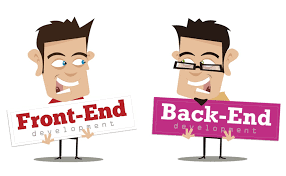

 # Bootcamp QA

 
 ### sprint 1
 
 
 ### Teste de Regressão
- "A equipe de QA preparou casos de teste para o teste de regressão do Urban Routes. Seu objetivo é executá-los e definir um status apropriado para cada teste. Como qualquer outro aplicativo, o Urban Routes tem vários bugs. Se nossos usuários tiverem uma experiência ruim, vão escrever avaliações ruins e provavelmente vão preferir usar outros aplicativos. É por isso que precisamos encontrar os bugs e enviá-los aos desenvolvedores para correção o mais rápido possível.

## Responsabilidades e Habilidades Adquiridas:

- Desenvolvimento de testes
- Introdução a elaboração de Checklists
- Elaboração de relatório de bugs
- Criação de casos de teste
- Resultado esperado e Resultado real
### Sprint 1 (Tópicos)
- O que são testes de software.
- Quais habilidades você precisa desenvolver para se tornar um analista de QA
Como criar testes para um site
- O que fazer após encontrar um defeito
## Informações adicionais
O Urban Routes é um aplicativo que cria rotas e calcula o tempo e custo da viagem para diferentes tipos de transporte.

A interface é bem simples: há dois campos para endereços, "De" e "Para". Além disso, há três modos ("Optimal," "Flash" e "Personal"), bem como ícones para os tipos de transporte (o carro do próprio usuário, a pé, táxi, bicicleta, scooter ou compartilhamento de carro)

### sprint 2

## Design-de-teste

Aqui fiz meu primeiro teste de equivalência e com valores-limite, onde fiz teste nas áreas dentro, fora e nos limites dela, esses testes foram feitos na funcionalidade de adicionar uma carteira de motorista ao app, além de ter aprendido o uso de mapa mental e fluxograma para um auxílio visual na totalidade dessa funcionalidade.

## As tarefas do projeto foram:

- Decompor e visualizar os requisitos com um mapa mental, um fluxograma e uma tabela.
- Definir os objetos de teste e projetar testes com a ajuda de técnicas de design de teste.
- Analisar os requisitos, encontrar áreas cinzentas e as especificar.
- Escrever casos de teste.

## Ferramentas usadas:

- Draw.io

## O aprendizagem no Bootcamp foi:

- Como são os requisitos de aplicativos e como os decompor
- Como mapas mentais e fluxogramas podem ajudar a visualizar esses requisitos
- O que são classes de equivalência e valores-limite e como usá-los para criar casos de teste"

### sprint 3

"Neste projeto, fiz o teste da funcionalidade compartilhamento de carro em dois ambientes:

-Google Chrome, resolução de tela 800x600 -Firefox, resolução de tela 1920x1080

Também desenvolvi novas maneiras de testes, fiz meu primeiro teste de equivalência e com valores-limite, testei nas áreas dentro, fora e nos limites dela, esses testes foram feitos na funcionalidade de adicionar uma carteira de motorista ao app, além de ter aprendido o uso de mapa mental para um auxílio visual na totalidade dessa funcionalidade.

- Analisei os designs e os requisitos do compartilhamento de carro.
- Explorei o aplicativo no ambiente de teste
- Estudei e analisei os designs no Figma
- Criei um checklist para o layout e janelas
## Ferramentas usadas:

- Figma 
- Jira 
- Excel

## O aprendizagem no Bootcamp foi:

O que são arquitetura cliente-servidor, front-end e back-end
O que são URL, HTTP e HTTPS
Como visualizar solicitações e respostas HTTP no DevTools do navegador
O que são cookies, armazenamento local e cache"

### sprint 4
## Urban Groucers

 "Neste projeto desarrollei as seguintes tarefas:

Criar e enviar solicitações à API via Postman
Criar relatórios de bug
Ler a documentação da API no Apidoc
Criar os primeiros testes de API
Testar a API através do Postman
Enviar relatórios de bug ao Jira
Ferramentas usadas:

Postman
Jira
Apidoc
O aprendizagem no Bootcamp foi:

O que é uma API
Como a arquitetura de um aplicativo com uma API e banco de dados é organizada
Como testar uma API
O que é a solução de arquitetura REST"

- Introdução ao sprint 4
- Introdução à API
- Introdução: Testes de API com Postman
- Enviar relatórios de bug ao Jira

## Ferramentas usadas:

- Postman
- Jira
- Apidoc
## O aprendizagem no Bootcamp foi:

O que é uma API
Como a arquitetura de um aplicativo com uma API e banco de dados é organizada
Como testar uma API
O que é a solução de arquitetura REST"

### projeto final

## Urban Scooter

Urban Scooter é uma plataforma interativa do Bootcamp que realizei na TripleTen. A plataforma oferece aluguel de scooters por dois dias. O serviço inclui a entrega e retirada da scooter na porta do cliente. Este projeto abrange a criação de uma interface funcional para o aluguel, com detalhes sobre o modelo PRO de scooter disponível.

## Testes que realizei:

Mapa Mental: Desenvolvi um mapa mental detalhado para a funcionalidade do formulário de pedidos, garantindo que todos os fluxos de trabalho fossem claramente definidos e compreendidos.
Checklist de Funcionalidades: Elaborei um checklist abrangente dos requisitos para a tela "Status do pedido", verificando se cada componente atendia aos critérios estabelecidos.
Validação de Campos: Criei e executei testes específicos para validar os campos na tela "Fazer pedido", assegurando que as entradas do usuário fossem tratadas corretamente.
Testes de Funcionalidade: Testei todas as funcionalidades da plataforma, não apenas utilizando checklists e tabelas, mas também revisando os designs e requisitos completos para garantir a consistência e a funcionalidade.
Testes de API: Além disso, validei os recursos da API do aplicativo, certificando-me de que os dados fossem processados e retornados de maneira eficaz.
Ferramentas que ultilizei:

- Xmind: Utilizado para criar o mapa mental, organizando visualmente as funcionalidades e fluxos de trabalho.
Navegadores web (Chrome, Opera): Utilizados para testar a interface e funcionalidades em diferentes ambientes e resoluções de tela
- Postman: Ferramenta para testar e validar as requisições e respostas da API, garantindo a integridade dos dados e a comunicação entre o front-end e o back-end.
- Gira: Utilizado para gerenciar e rastrear bugs encontrados durante os testes, facilitando a correção e o acompanhamento dos problemas.
- Figma: Ferramenta para revisar e testar o design da interface, garantindo que a implementação seguisse fielmente os requisitos visuais e de usabilidade.

O projeto Urban Scooter não só exemplifica o conhecimento técnico adquirido no Bootcamp da TripleTen, mas também destaca a importância de um processo de desenvolvimento orientado por testes para garantir a qualidade e a satisfação do usuário."

